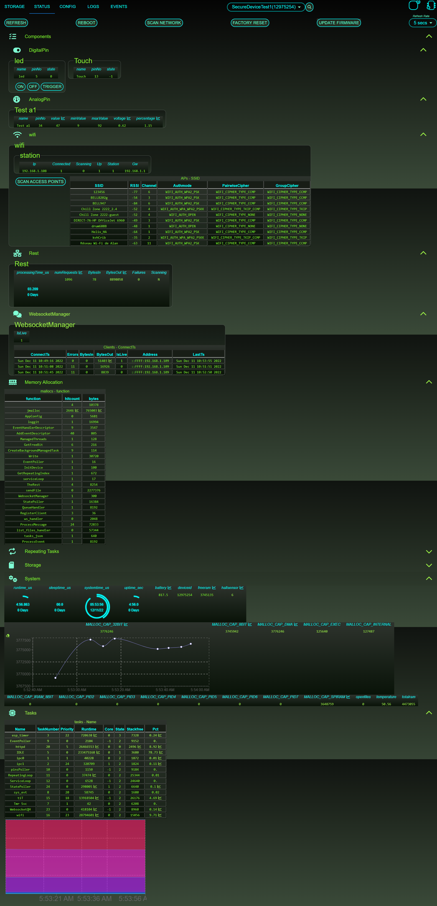
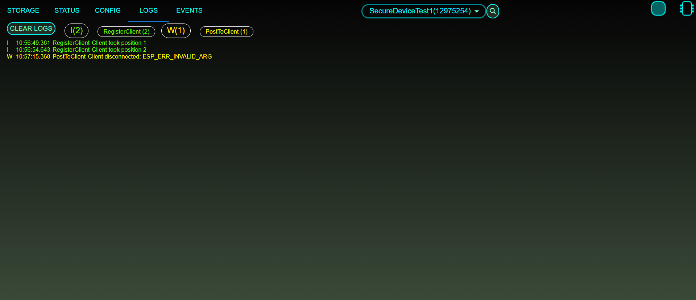

======
Kernel
======

This project is to manage an ESP32 MCU and use it as a REST service and WebSocket for real time updates

Components
==========

This project includes the following components:

The ESP32 firmware
------------------
- `Entry point <https://github.com/Louis-Riel/kernel/blob/master/main/Blink.cpp>`_
- `LED Apa102 <https://github.com/Louis-Riel/kernel/tree/master/components/apa102>`_
- `Infrared Reader <https://github.com/Louis-Riel/kernel/tree/master/components/IR>`_
- `Digital/Analog Pins <https://github.com/Louis-Riel/kernel/tree/master/components/pins>`_
- `Servo Motors <https://github.com/Louis-Riel/kernel/tree/master/components/servo>`_
- `GPS <https://github.com/Louis-Riel/kernel/tree/master/components/TinyGPS>`_
- `Web Server <https://github.com/Louis-Riel/kernel/tree/master/components/rest>`_

Web Servers
-----------
- `Front Gate <https://github.com/Louis-Riel/kernel/tree/master/res/web/front-gate>`_
- `Key Manager <https://github.com/Louis-Riel/kernel/tree/master/res/web/gate-keeper>`_

Web Apps
--------
`ESP32 Management <https://github.com/Louis-Riel/kernel/tree/master/res/web/app>`_

`ESP32 Administration <https://github.com/Louis-Riel/kernel/tree/master/res/web/admin>`_

Services
--------
- `Device Finder/Configuration <https://github.com/Louis-Riel/kernel/tree/master/res/web/service>`_
